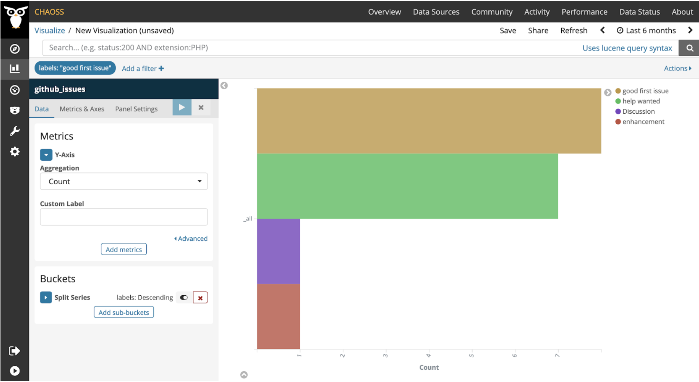

# Issue Label Inclusivity
Question: How well are project issues labeled to invite new contributors, skilled contributors, non-code contributors, and other types of contributors?

## Description
Issue label inclusivity helps gauge the affordability of issues to different contributors at different levels of familiarity (e.g., newcomer, occasional contributor, and core contributors), with different skills (e.g., languages, frameworks, APIs, documentation, frontend, and backend), and with different goals (e.g., code and non-code contributions).

## Objectives

*__Newcomer Friendly__*: Issues include appropriately labeled issues (e.g, “good first issue”, “newcomer-friendly”) for a new contributor to start with. 

*__Mentor Availability__*: Issues identify a mentor who can provide guidance and help with the review process of a particular issue (e.g., “Mentor Available” tag)

*__Issue List Diversity__*: Issues provide a diverse list of labels pertaining to different types of contributions (code and/or non-code) (e.g., “Documentation” tag)

*__Usable Title and Description__*: Issue titles and descriptions follow the Documentation Usability metric objectives 
 
*__Consistent Use of Labels__*: Issues use a curated list of labels with distinct colors in a consistent way. 
For example, families of tags with a distinct color for each:

- Issue Type: “Feature” vs “Bug” vs “Documentation” ...
- Issue Skills: the skills needed to resolve the issue (e.g, js, html, css...)
- Issue Level of Familiarity: mentions the lowest level of familiarity needed (“good for newcomer” or “occasional contributor”or “core contributor”)

## Implementation

#### Filter ####

- Type of label
- Type of repository
- Age of open issue
- Number of open issues
- Date an issue was opened 
- Code-related issues vs. documentation-related issues

#### Visualization ####

From: https://github.com/kubernetes/kubernetes/labels 
Tools Providing the Metric:
- Grimoire Lab 
- Augur

### Data Collection Strategies

- Identify the published list of issue labels used for each project 
   - *General labels*: 
      - Presence of labels to identify general needs of  “Feature”, “Bug”, and “Documentation” label”, a “Front End”, and a “Back End” labels in the project’s list of labels and in the issue list (labels in use)
   - *Inclusive labels*:
     - Newcomer friendly ones look for (*newcomer*, *first*) in the project’s list of labels and in the issue list (labels in use)
     - Mentor friendly ones look for (*mentor*) in the project’s list of labels and in the issue list (labels in use)

  - *Skill labels*: 
     - Presence of labels to identify skills needed (e.g, Java, Python, HTML, machine learning) in the project’s list of labels and in the issue list (labels in use)

- Observe the frequency of each label used across issues in a project.

## References
- [GitHub Satellite](https://githubsatellite.com/)
